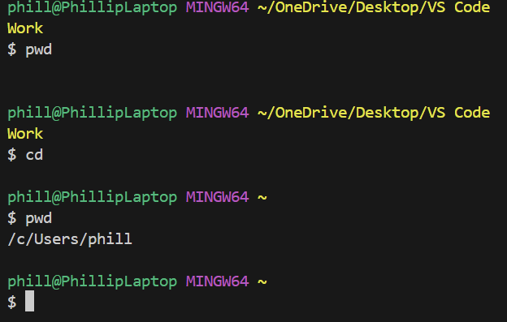
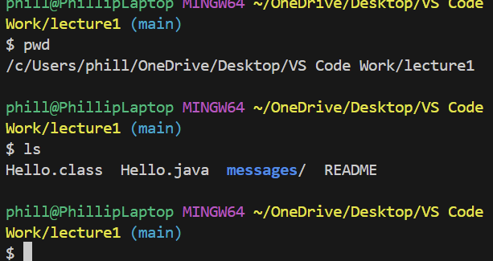
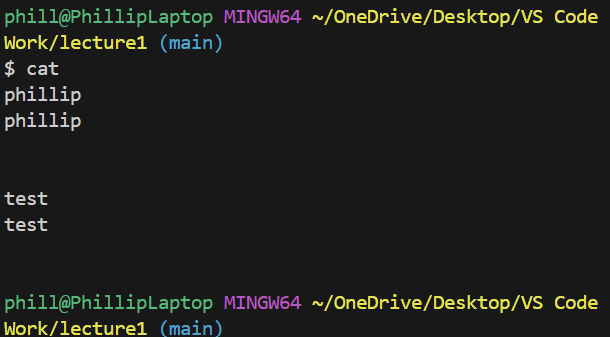
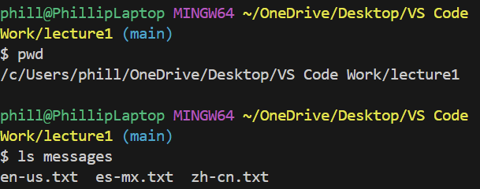
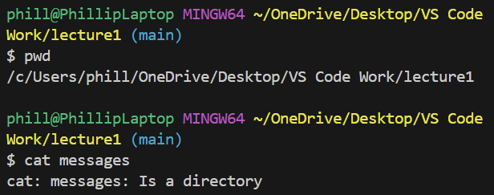
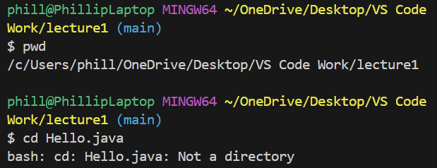
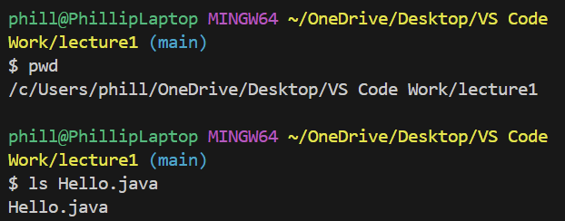
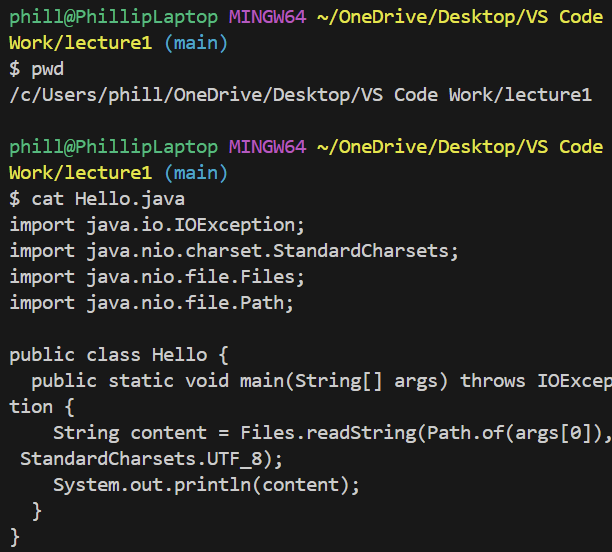

# Lab Report 1
Phillip Schiffman
***
## Using the commands with no arguments
1.) `cd`

- The `cd` with no arguments returns you to the home directory
- The absolute path was `/c/Users/phill/OneDrive/Desktop/VS Code Work` when the command was run
- The `cd` with no arguments is not an error

2.) `ls`

- The `ls` with no arguments returns all of the contents in the directory
- The absolute path was `/OneDrive/Desktop/VS Code Work/lecture1`
- The `ls` argument can create an error if you are currently inside a file, but in this case, there is no error message

3.) `cat`
   

- The `cat` with no arguments creates a box where you can input text, and whatever you input is printed in the line below. You can get out of the input box by using Ctrl+C
- The absolute path was `/OneDrive/Desktop/VS Code Work/lecture1`
- The `cat` argument did not create an error

***

## Using the commands with a path to a directory as an argument
1.) `cd`
   

- The `cd` argument with a directory path takes you to the directory you specified, as long as it exists
- The absolute path was `/OneDrive/Desktop` and I used the `cd` argument to get into the `/OneDrive/Desktop/VS Code Work` directory, and then into the `/OneDrive/Desktop/VS Code Work/lecture1` directory
- The `cd` argument did not create an error because I specified the correct directory that I wanted to get into

2.) `ls`
   

- The `ls` argument with a directory path returns the names of the files within the directory you specified as long as the directory exists
- The absolute path was `/OneDrive/Desktop/VS Code Work/lecture1` and I used the `ls` argument on the `/OneDrive/Desktop/VS Code Work/lecture1/messages` directory in order to return the 3 files within the `/OneDrive/Desktop/VS Code Work/lecture1/messages` directory
- The `ls` argument did not create an error because I specified the correct directory that I wanted to return file names from, and there were files within the directory.

3.) `cat`
   

- The `cat` argument with a directory path returns an error message of, `cat: messages: Is a directory` because the `cat` argument is used to print the content of files
- The  `cat` argument will also create an error message if the directory does not exist
- The absolute path was `/OneDrive/Desktop/VS Code Work/lecture1` and I used the `cat` argument on the `/OneDrive/Desktop/VS Code Work/lecture1/messages` directory which resulted in the error

***

## Using the commands with a path to a file as the argument
1.) `cd`

- The `cd` argument with a file path returns an error message of, `bash: cd: Hello.java: Not a directory` because the `cd` argument is used to traverse directories not files
- The absolute path was `/OneDrive/Desktop/VS Code Work/lecture1` and I used the `cd` argument on the `/OneDrive/Desktop/VS Code Work/lecture1/Hello.java` file which resulted in the error

2.) `ls`

- The `ls` argument with a file path returns the path of the file as long as the file exists
- The absolute path was `/OneDrive/Desktop/VS Code Work/lecture1` and I used the `ls` argument on the `/OneDrive/Desktop/VS Code Work/lecture1/Hello.java` file which returned the name of the file, `Hello.java`
- Using the `ls` argument with the file path did not result in an error because the file I used existed

3.) `cat`

 

- The `cat` argument with a file path prints out the file contents as long as the file exists
- The absolute path was `/OneDrive/Desktop/VS Code Work/lecture1` and I used the `cat` argument on the `/OneDrive/Desktop/VS Code Work/lecture1/Hello.java` file which returned the contents of the `Hello.java` file
- No error occured because the file existed inside the directory that I was in

