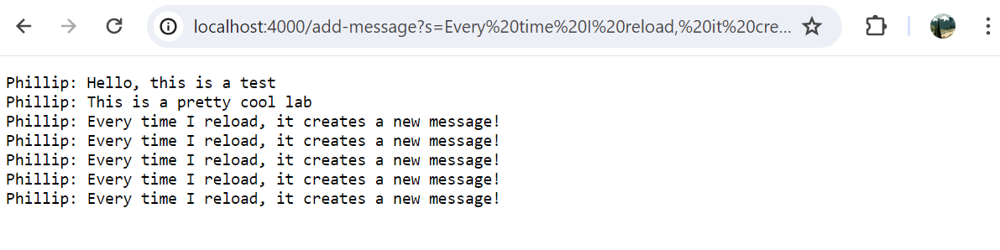
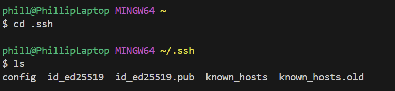
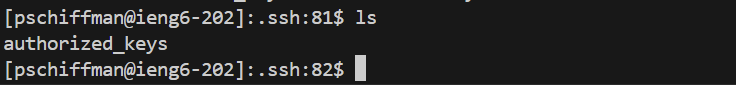
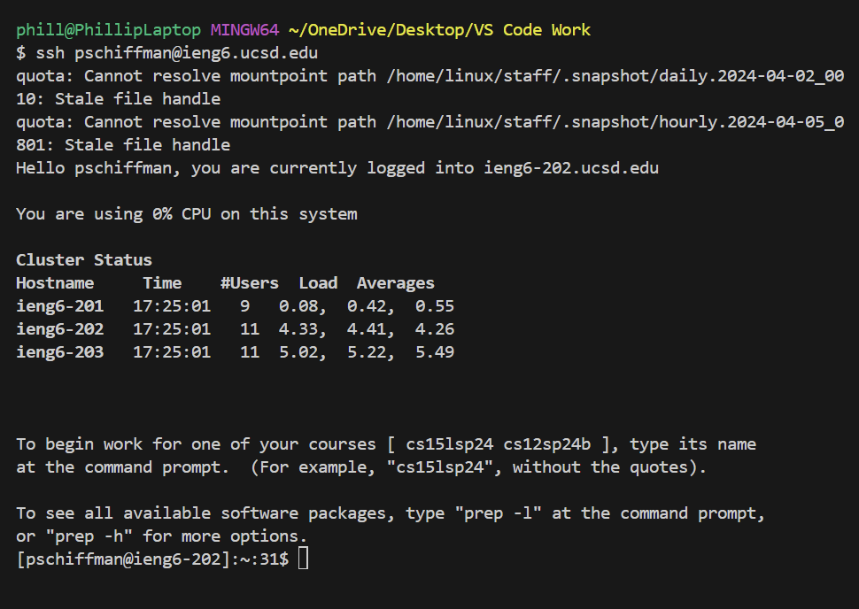

# Lab Report 2
Phillip Schiffman
***
# Part 1
## Here is the code I used for the ChatServer!
```
import java.io.IOException;
import java.net.URI;
import java.util.ArrayList;

class Handler implements URLHandler {
    String output = "";

    public String handleRequest(URI url) {
        if (url.getPath().contains("/add-message")) {
            String[] queries = url.getQuery().split("&");
            String[] messages = queries[0].split("=");
            String[] users = queries[1].split("=");
            String message = messages[1];
            String user = users[1];
            ArrayList<String> outputs = new ArrayList<String>(); 
            outputs.add(String.format(user + ": " + message + "\n"));
            for(int i = 0; i < outputs.size(); i++){
                output += outputs.get(i);
            }
            return output;
        } else {
            return "404 not found!";
        }
    }
}

class ChatServer {
    public static void main(String[] args) throws IOException {
        if(args.length == 0){
            System.out.println("Missing port number! Try any number between 1024 to 49151");
            return;
        }

        int port = Integer.parseInt(args[0]);

        Server.start(port, new Handler());
    }
}
```
***
## Now, using the ``` /add-message ```


- In this case, the main method is run in the ```ChatServer``` class, and it calls the ```handleRequest``` method because the port is inputted
- Then, the ```if``` statement is run because the url contains the ```"add-message"```
- Next, my code uses the ```url.getQuery.split()``` command to split the url based on the ```"&"``` in the url. This allows me to split the url into even more parts to isolate the message and user that will be in the final message
- To do this, I use another ```.split``` which allows me to have the message and the user in 2 separate arrays ```messages``` and ```users```
- Now, I can simply create the variables ```message``` and ```user``` which will hold the different values by calling their respective arrays
- So, in this scenario, the ```message``` becomes ```"Hello, this is a test"``` and the ```user``` becomes ```"Phillip"```
- Next, an ArrayList ```outputs``` is created in order to hold all of the messages throughout the site.
- Then, I add the message to ```outputs```, so in this case the value in ```outputs``` would be, ```"Phillip: Hello, this is a test \n"``` and the ```"\n"``` is needed in order to make a new line
- Finally, I loop through all of the elements in ```outputs``` and add them together into one String ```output``` which becomes the final result and is printed. So, in this scenario, the desired result of ```"Phillip: Hello, this is a test"``` is printed
***


- In this case, the main method is run in the ```ChatServer``` class, and it calls the ```handleRequest``` method because the port is inputted
- Then, the ```if``` statement is run because the url contains the ```"add-message"``` and this is done every time the url is run
- Next, my code uses the ```url.getQuery.split()``` command to split the url based on the ```"&"``` in the url. This allows me to split the url into even more parts to isolate the message and user that will be in the final message
- To do this, I use another ```.split``` which allows me to have the message and the user in 2 separate arrays ```messages``` and ```users```
- Now, I can simply create the variables ```message``` and ```user``` which will hold the different values by calling their respective arrays
- So, in this scenario, the first ```message``` becomes ```"Hello, this is a test"``` and the ```user``` becomes ```"Phillip"```
- Next, an ArrayList ```outputs``` is created in order to hold all of the messages throughout the site.
- Then, I add the message to ```outputs```, so in this case the value in ```outputs``` would be, ```"Phillip: Hello, this is a test \n"``` and the ```"\n"``` is needed in order to make a new line
- Finally, I loop through all of the elements in ```outputs``` and add them together into one String ```output``` which becomes the final result and is printed. So, in this scenario, the desired result of ```"Phillip: Hello, this is a test"``` is printed
- Now, when the url is re-ran, the ```queries```, ```messages```, and ```users``` arrays are reset into the new queries, which then changes the ```message``` and ```user`` variables as well.
- So, for the 2nd url that is inputted, the ```message``` variable becomes ```"This is a pretty cool lab"``` and the ```user``` variable becomes ```Phillip```
- Then, it gets added to the ```outputs``` ArrayList, and finally the ```output``` is returned, which will now be
```
Phillip: Hello, this is a test
Phillip: This is a pretty cool lab
```
- Finally, this is run again with the next arguments, and the process can keep going until the program is closed
- So, the final result will end up being
```
Phillip: Hello, this is a test
Phillip: This is a pretty cool lab
Phillip: Every time I reload, it becomes a new message!
Phillip: Every time I reload, it becomes a new message!
Phillip: Every time I reload, it becomes a new message!
Phillip: Every time I reload, it becomes a new message!
Phillip: Every time I reload, it becomes a new message!
```
***
# Part 2
## Screenshots



***
# Part 3
In lab 3, I learned about the uses of public and private keys when SSHing into a server. Before this lab, I didn't realize that each computer had it's unique identity that would be shared to the server. Originally, I thought it would just save your password, rather than have an ID with a private and public value.
