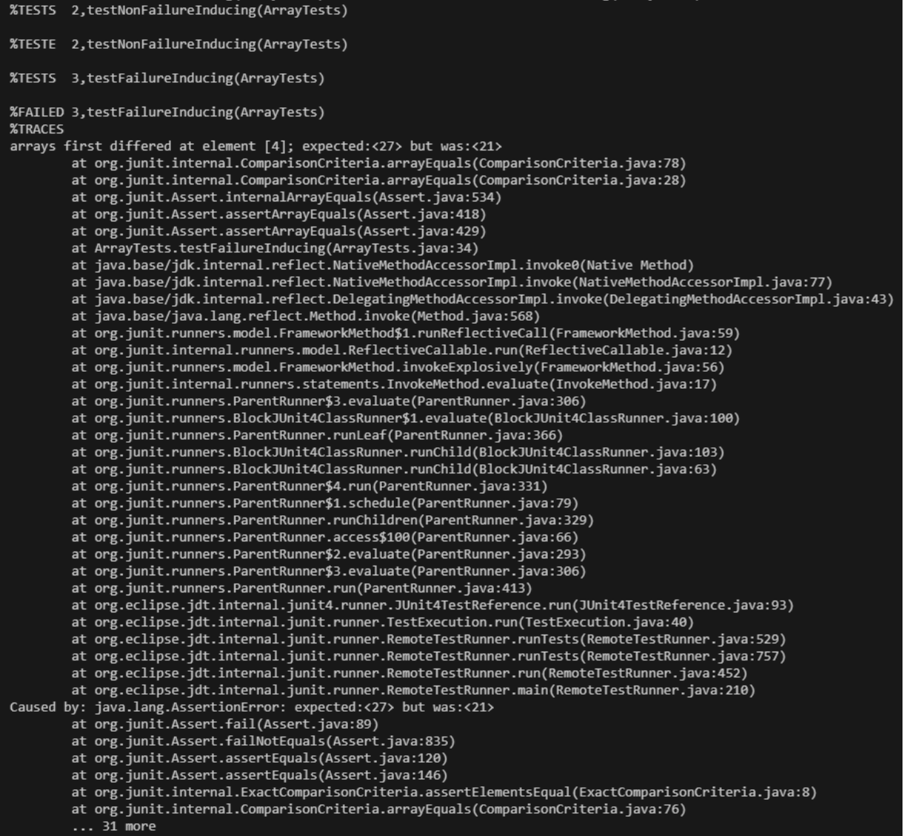

# Lab Report 3
Phillip Schiffman
***
# Part 1 - Bugs
## Buggy Code
The Buggy Code I will be analyzing is: 
```
// Changes the input array to be in reversed order
static void reverseInPlace(int[] arr) {
  for (int i = 0; i < arr.length; i++) {
    arr[i] = arr[arr.length - i - 1];
  }
}
```
- The method above, ```reverseInPlace```, intends to reverse the input ```int[]``` array in place
- This method uses a for-loop to iterate through the length of the ```arr``` array, and attempts to replace each index with its mirrored index
- Overall, this causes a bug in the desired output represented in the following lines:
  - Each index in the first half of the array is set to its mirrored index in the second half of the array and is consequently overwritten
  - Each index in the second half of the array is set to its mirrored index in the first half of the array. As the values in the first half of the array are now overwritten, the second half of the array remains unchanged
  - Thus, the code results in the second half of the array being mirrored onto the first half
## Test Cases for Buggy Code
*Failure Inducing Input*
```
@Test
  public void testFailureInducing() {
    int[] input = {1, 2, 3, 4, 5};
    ArrayExamples.reverseInPlace(input);
    assertArrayEquals(new int[]{5, 4, 3, 2, 1}, input);
  }
```
- This code shows the failure inducing input for a JUnit test for the ```reverseInPlace()``` method
- In this method, an ```int[]``` is created called ```input``` which has values of ```{1,2,3,4,5}```
- Next, the ```reverseInPlace()``` method is called with ```input``` being the parameter used
- Given the buggy code within ```reverseInPlace()```, the subsequent ```assertArrayEquals``` should show a failure
- The actual expected code should be ```{5,4,3,4,5}``` rather than the desired ```{5,4,3,2,1}```
- This all happens because of the mirror bug within the code. This function copies one by one, which in turn will simply copy something that has already been changed, and will result in the bug described
- So, the desired output will not be outputted, and this test will result in a failure

*Non-Failure Inducing Input*
```
@Test
  public void testNonFailureInducing() {
    int[] input = {5,4,3,4,5};
    ArrayExamples.reverseInPlace(input);
    assertArrayEquals(new int[]{5,4,3,4,5}, input);
  }
```
- This code shows the non-failure inducing input for a JUnit test for the ```reverseInPlace()``` method
- In this method, an ```int[]``` is created called ```input``` which has values of ```{5,4,3,4,5}```
- Next, the ```reverseInPlace()``` method is called with ```input``` being the parameter used
- Even though there is buggy code, within ```reverseInPlace()```, the subsequent ```assertArrayEquals``` will not produce a failure because of the ```input``` we gave
- When this is run, within the ```reverseInPlace()``` method the code will mirror the items from the second half of the array to the first half, but since the given ```input``` is already a mirror of itself, nothing will change
- Therefore, the code will result in no failures detected, because although the values are changing, the numbers are still the same, which will read as a test passed

## System Output



- This shows the JUnit output for the tests described above
- As described earlier, the non-failure-inducing test passes because the array, ```input``` is already being mirrored within itself. For instance, the values that make up the 2nd half of the array are already in the same order but on both the first and second halfs of the array. This makes it so that when the function tries to copy an item from the second half, nothing changes

## Fix for Buggy Code

```
// Changes the input array to be in reversed order
static void reverseInPlace(int[] arr) {
  for (int i = 0; i < arr.length; i++) {
    int temp = arr[i];
    arr[i] = arr[arr.length - i - 1];
    arr[arr.length - i - 1] = temp;
  }
}
```

- The method above is a revamped version of the old ```reverseInPlace()``` method
- In this new version, within the for loop, we create a new variable of type ```int``` called ```temp```
- With this new variable, we create a temporary value for the item that needs to be replaced, and we can therefore swap the items instead of directly placing one with the lines below
- For instance, when the code is run, we store the value of the item being iterated in ```temp```, then we switch the current ```arr``` value for a value of the item on the other side of the array, and then we replace the last value with the ```temp``` value
- All of this is being done in the lines ```arr[i] = arr[arr.length - i - 1];``` and ```arr[arr.length - i - 1] = temp;```
- To replace the last value with the ```temp``` value, we simply call the item in ```arr``` by using ```length - i - 1``` which will allow us to get the opposite side of the array from where we are iterating
- Overall, this fixed the bug in the code because now instead of simplying copying the items one by one, it swaps the items so that there becomes no mirroring within the array

# Part 2 - Researching Commands


