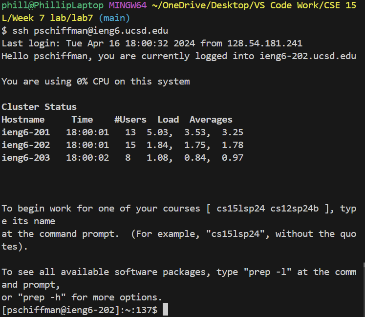
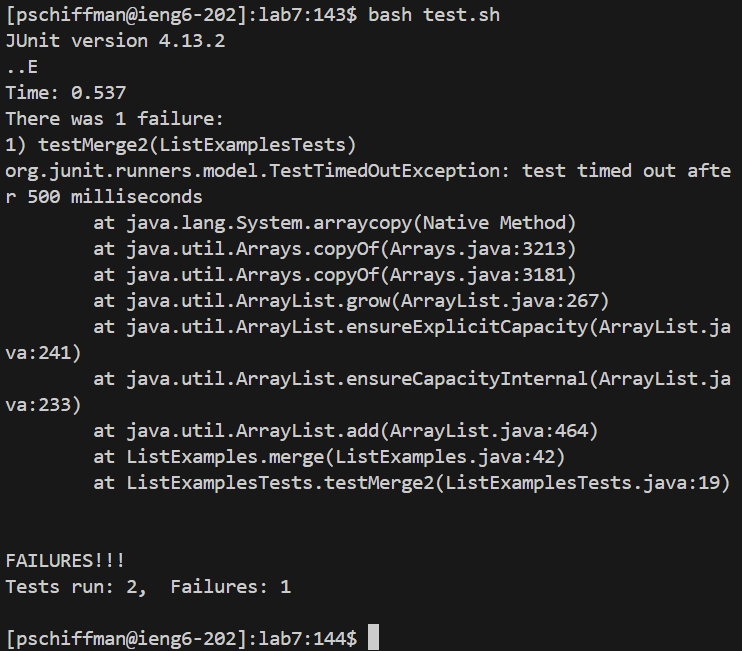
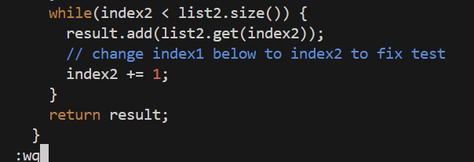
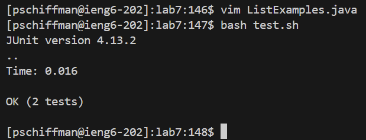
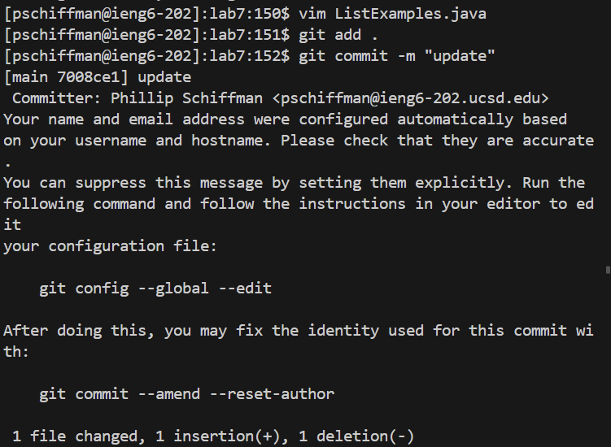

# Lab Report 4
## Phillip Schiffman

## Step 4.)


- To achieve Step 4, I used ```ssh<space>pschiffman@ieng6.ucsd.edu<enter>``` which told the system to ```ssh``` into the ```ieng6``` server at UCSD
- This being said, I had to give my username ```pschiffman``` which let me enter into the server
- The output can be seen above

## Step 5.)


- To achieve Step 5, I cloned the fork of the ```lab7``` repository on GitHub, by using the ```SSH clone url``` that we made during the lab
- Then, in my terminal, I typed ```git<space>clone<space>https://github.com/PhillipS72/lab7.git<enter>``` which allowed me to clone the fork into the ```ieng6``` server for future use
- The output can be seen above

## Step 6.)


- To achieve Step 6, I had to run the ```test.sh``` script which would run the tests within ```ListExamplesTests.java```
- In order to do this, I had to ```cd``` into the ```lab7``` directory by typing ```cd<space>lab7<enter>``` which proceeded with the ```cd``` command
- Then, I had to run the ```test.sh``` script by typing ```bash<space>test.sh<enter>``` which ran the ```test.sh``` script, and we found that the tests failed
- The output can be seen above

## Step 7.)


- To achieve Step 7, I had to run the ```vim``` command on ```ListExamples.java``` to find and fix the buggy code
- To do this, I typed ```vim<space>ListExamples.java<enter>``` which allowed me to view the ```ListExamples.java``` file through ```vim```
- Next, since my cursor started at the bottom I clicked ```<up><up><up><up><up><up>``` and then ```<right><right><right><right><right><right><right><right><right><right><right>``` which took me to the number ```1``` within the ```index1``` variable
- Next, I clicked ```x``` which deleted the ```1``` in ```index1```
- Then, I clicked ```i``` in order to get into ```insert``` mode, and then I clicked ```2``` to switch ```index1``` to ```index2```
- Next, I clicked ```esc``` to exit out of ```insert``` mode, and then I typed ```:wq<enter>``` in order to save and exit the ```vim``` mode
- All of these steps allowed the bug in the file to be fixed, and the fixed code can be shown above

## Step 8.)


- To achieve Step 8, I had to run the ```test.sh``` script to run the tests within ```ListExamplesTests.java``` which I did by typing ```bash<space>test.sh<enter>``` into the terminal
- This ran the tests, which showed that all of them passed
- The output can be seen above

## Step 9.)


- To achieve Step 9, I had to add the new files to the workspace, then commit them with a message
- In order to do this, I typed ```git<space>add<space>.<enter>``` which added all of the files within the ```lab7``` directory to the workspace
- By using the ```.``` it allowed all of the files rather than just a few, I did this because I thought it would be easier and more convenient rather than typing out entire file names
- Next, I typed ```git<space>commit<space>-m<space>"update"<enter>``` which allowed me to commit the files added to the workspace to my github account
- Since my account was already linked with the ```ieng6``` server, nothing else was needed
- The output can be seen above
