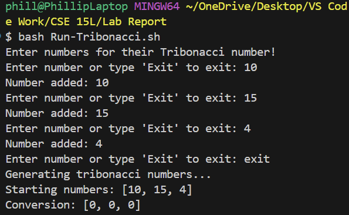
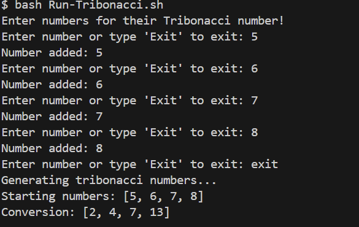

# Lab Report 5
## Phillip Schiffman
###
## Original Student Post
Hello everyone,

At the moment I'm having trouble trying to debug my Tribonnaci Sequence code, and any help would be greatly appreciated. 

Here's my problem: My Tribonnaci code consistently returns 0 no matter the input. I've checked my code a numberous amount of times, but I can't quite find the error. Can someone help? I've attached the symptoms below.



Thanks so much!

## First TA Response

Hello!

Thanks for posting this question, I'll try my best to lead you in the right direction. First, let's focus on some common mistakes that others are having. 

- First, I recommend checking the base case within your ```tribonacci``` function, and make sure you have the correct code. Then, run the code and make sure you are getting the expected values.
- Another thing you can check is the amount of recursive calls. Make sure that your instance ```value``` is called correctly and there are no issues within the recursion chain.

I hope this helps! Good Luck!

## Student Response

Hi [TA],

Thanks to your response, I was able to debug my code and resolve this issue! 

Upon revisiting the base cases you were talking about, I found a small syntax error within my ```tribonacci``` function. At first, I had that if the ```value``` being passed was ```0```,```1```,```2```, or ```3``` then we would return ```0```. However, after checking the base cases, I realized that for a tribonacci sequence, we should only return ```0``` for when value equals ```0```,```1```, or ```2```, not ```3```.

So, I created another ```if``` statement that checks for ```value``` being ```3```, and if it is, we will return ```1``` rather than ```0```.

I attached some working screenshots below!



Thanks again!

## Setup Information

# File and Directory Structure
```
+-- Lab-Report
|   +-- Tribonacci.java
|   +-- Run-Tribonacci.sh
```

# File Contents
- ```Tribonacci.java```
```
import java.io.IOException;
import java.nio.file.Files;
import java.nio.file.Path;

public class Tribonacci {
    public static void main(String[] args) {
        // Create numbers[] from numbers.txt and print them
        int[] numbers = arrayFromFile("numbers.txt");
        System.out.print("Starting numbers: [");
        for (int i = 0; i < numbers.length; i++) {
            if (i == numbers.length - 1) { 
                System.out.println(numbers[i] + "]"); 
            }
            else { 
                System.out.print(numbers[i] + ", "); 
            }
        }
        // Get each tribonacci and print them
        int[] tribonacci_numbers = new int[numbers.length];
        for (int i = 0; i < numbers.length; i++) { 
            tribonacci_numbers[i] = tribonacci(numbers[i]); 
        }
        System.out.print("Conversion: [");
        for (int i = 0; i < numbers.length; i++) {
            if (i == numbers.length - 1) { 
                System.out.println(tribonacci_numbers[i] + "]"); 
            }
            else { 
                System.out.print(tribonacci_numbers[i] + ", "); 
            }
        }
    }

    // Create numbers from the provided file
    private static int[] arrayFromFile(String fileName) {
        try {
            Path path = Path.of(fileName);
            int[] numbers = Files.lines(path).mapToInt(Integer::parseInt).toArray();
            return numbers;
        } catch (IOException e) {
            System.out.println("Error reading the file: " + e.getMessage());
            return null;
        }
    }

    private static int tribonacci(int value) {
        if (value == 0 || value == 1 || value == 2) {
            return 0;
        }
        if (value == 3) {
            return 0; // Error
        }
        return tribonacci(value - 1) + tribonacci(value - 2) + tribonacci(value - 3);
    }
}
```
- ```Run-Tribonacci.sh```
```
if [ -f "numbers.txt" ]; then
    rm numbers.txt
    touch numbers.txt
fi

echo "Enter numbers for their Tribonacci number!"

while true; do
    read -p "Enter number or type 'Exit' to exit: " input

    input_lower=$(echo "$input" | tr '[:upper:]' '[:lower:]')

    if [[ "$input_lower" == "exit" ]]; then
        echo "Generating tribonacci numbers..."
        break
    fi

    if [[ "$input" =~ ^[0-9]+$ ]]; then
        echo "Number added: $input"
        echo $input >> numbers.txt
    else
        echo "Please enter a number or 'Exit'. Try again."
        exit
    fi
done

javac Tribonacci.java

if [ $? -ne 0 ]; then
    echo "Error with Tribonacci.java"
fi

java Tribonacci
```
# Command Line Input

- To encounter the bug in the code, I had to start with running the code. In order to do this, I typed ```bash<space>Run-Tribonacci.sh<enter>``` which then prompted me with the following: ```Enter numbers for their Tribonacci number!```
- After this, the code prompted me with ```Enter number or type 'Exit' to exit:``` in which I typed `10<enter>`, then I was prompted with the same message. In which I typed ```15<enter>```, then the same where I typed ```4<enter>```. Finally, I got the same message and opted to type ```exit``` which generated the tribonacci numbers, and resulted in the bug.

# Fixing the Bug

- This bug can be found within the ```Tribonacci``` class, and then more specifically within the ```tribonacci``` method. Here is the code for the ```tribonacci``` method, including the bug:

```
private static int tribonacci(int value) {
        if (value == 0 || value == 1 || value == 2) {
            return 0;
        }
        if (value == 3) {
            return 0; // Bug
        }
        return tribonacci(value - 1) + tribonacci(value - 2) + tribonacci(value - 3);
    }
```

- As one can see, we accidentally call ```return 0``` rather than ```return 1``` which results in the bug. Since we have ```0``` here, we accidentally add 0's rather than 1's when ```value``` is equal to ```3```. This ultimately breaks the tribonacci sequence, so we won't get the correct values.
- After fixing the code, it should look the same as below:

```
private static int tribonacci(int value) {
        if (value == 0 || value == 1 || value == 2) {
            return 0;
        }
        if (value == 3) {
            return 1;
        }
        return tribonacci(value - 1) + tribonacci(value - 2) + tribonacci(value - 3);
    }
```

- This fixed code now returns the proper ```value``` needed to complete the tribonnaci sequence!

## Reflection

- In the second half of this quarter, I learned a lot within the Labs. One thing that was the most interesting to me was Vim. I really enjoyed going through the little tutorial completely using the keyboard, and it was a fun challenge. I also like how useful Vim can be. I learned about the uses of it, and found that it can be very helpful within a multitude of situations. 
